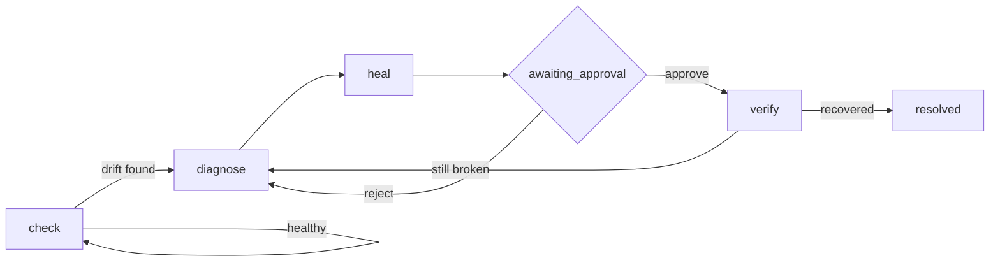

<div align="center">

# Molt

**Scraper Reliability Engineering for [Bright Data Scraper Studio](https://brightdata.com/products/web-scraper).**

Scrapers don't fail loudly. They lie.

Built for [Into the Scrape-Verse](https://www.wemakedevs.org/hackathons/scrape-verse) · WeMakeDevs × Bright Data

[](https://github.com/PrinceXDev/molt-scraperstudio/actions/workflows/ci.yml)


[](LICENSE)

</div>

---

> A site renames a CSS class. The request still returns **HTTP 200**. Bright Data still reports the
> job `done`. The row count is unchanged. And `price` is `null` on all 1,198 rows.
>
> Every monitoring tool watches the wrong layer. Uptime checks pass, error rates are zero, the
> pipeline keeps running — and the numbers are quietly wrong for three weeks until someone notices a
> report looks strange.

It gets worse. When Molt's own chaos target moved two numeric fields into a different element, the
scraper didn't return `null` for them. **It returned `0`.**

```
rows  60
score ███████████████░░░░░  75
status  BROKEN  2 of 8 fields returned only zeros: comment_count, download_count

  ≠ comment_count   60.5 → 0  distorted
  ≠ download_count  20251.5 → 0  distorted
```

Row count unchanged. Job `done`. HTTP 200. And `download_count: 0` is an entirely plausible number —
**every null check in the world passes this.** Only comparing the distribution catches it: a median of
20,251 going to zero.

## What Molt does

Molt treats scraper breakage the way SRE treats an outage: detection, diagnosis, remediation, an
approval gate, verification, and a post-incident record.



| Stage        | What happens                                                                                                                       | Bright Data surface                                                |
| ------------ | ----------------------------------------------------------------------------------------------------------------------------------- | -------------------------------------------------------------------- |
| **Detect**   | Run, snapshot, compare to baseline. Fill-rate collapse, schema drift, value distortion, empty harvest.                             | `bdata scraper run`, `/dca/collectors_list`, `/dca/collector/jobs` |
| **Diagnose** | Compose the heal prompt **from the measured drift** — the dead fields, their before/after numbers, and the fields that still work. | —                                                                    |
| **Heal**     | Run the real CLI, capture the approval gate and its `preview_result`.                                                              | `bdata scraper heal`                                                |
| **Review**   | Baseline vs broken vs preview, field by field, measure chosen per field.                                                           | —                                                                    |
| **Approve**  | A person decides.                                                                                                                  | `bdata scraper approve` / `--reject`                                |
| **Verify**   | Re-run. The incident closes **only** if the data actually recovered.                                                               | `bdata scraper run`                                                 |
| **Record**   | Immutable timeline, every command verbatim, same `c_*` throughout.                                                                 | `/dca/log/{job_id}`                                                  |

**Bright Data isn't a data source here, it's the architecture.** Molt's whole value — repairing a
scraper from a plain-language description without changing the Collector ID that downstream systems
depend on — exists only because Scraper Studio has `heal`. Remove Bright Data and there is no product
left.

### The bit nobody else automates

Every self-healing demo has a human read the failure and type a description of it. Molt derives the
description from the evidence:

> `comment_count` still fills but its values changed scale (typical value was 60.5, now 0);
> `download_count` still fills but its values changed scale (typical value was 20,251.5, now 0).
> Re-capture `comment_count` and `download_count` from the current markup, keeping the existing
> field names. Fields `category`, `date`, `summary`, `tags`, `title` and `version` are
> unaffected and still extracting normally — leave them as they are.

430 characters, generated. That last sentence is the highest-leverage part: telling the healer what
**not** to touch localises the fix, so it repairs two fields instead of rewriting a working scraper.

## Status

| Capability                                                       | Status | Evidence                                                          |
| ------------------------------------------------------------------ | :----: | -------------------------------------------------------------------- |
| Real `create` → real `c_*` Collector ID                            |   ✅   | Two live collectors, table below                                     |
| Drift detection (fill-rate, schema, distortion, empty harvest)     |   ✅   | `packages/health`, 100% pure, no I/O                                  |
| Heal-prompt generation from measured drift                         |   ✅   | `packages/diagnose`, ≤1000 chars, capped and tested                  |
| Real `bdata scraper heal`, gated behind human approval              |   ✅   | `apps/sentinel` (`molt watch`/`review`/`approve`)                    |
| Verification that closes an incident only on measured recovery     |   ✅   | `Engine.check` + `runVerify`, `packages/core/test/engine.test.ts`     |
| Scheduled unattended watch, opens a GitHub issue on drift           |   ✅   | `.github/workflows/molt-watch.yml`                                    |
| Public playground — preflight, drift replay, live check, create    |   ✅   | `apps/web/app/(site)/playground`                                     |
| Persistent fleet database (not per-run memory)                      |   ✅   | Turso/libSQL, `packages/store`                                       |
| Cockpit visually re-skinned onto the public design system           |   🚧   | Functionally complete; visual pass still open                        |

## Live collectors

Both are real, and both are the proof.

| Role        | Collector ID           | Target                                                                          | Why                                                                     |
| ----------- | ---------------------- | ------------------------------------------------------------------------------- | ------------------------------------------------------------------------ |
| **Primary** | `c_mt0z2fn11aj6lk4bdz` | [postgresql.org/support/security](https://www.postgresql.org/support/security/) | Genuine long-tail target. **327 CVE advisories from one page load.**     |
| **Chaos**   | `c_mt101cvbc0o34ghzh`  | [molt-chaos.vercel.app](https://molt-chaos.vercel.app)                          | Ours, deliberately breakable, so healing can be demonstrated on demand. |

The chaos target exists because most self-healing demos never show healing — nothing breaks on command
during a hackathon week. `apps/chaos` is a fixed dataset behind a switchable layout: **one deploy
changes the markup at the same URL**, which is exactly how a real redesign reaches production.

```bash
node scripts/chaos-deploy.mjs 2
```

## How this uses Bright Data

Molt is built *around* Scraper Studio, not beside it — every mutation is a real, recorded invocation
of the actual CLI, never a REST reimplementation of it:

- **Create** the scraper with Scraper Studio's AI generation
  (`bdata scraper create <url> "<description>"`, wrapped by `molt add`) — preflighted for size and
  robots.txt first, because a failed create leaves an orphan Bright Data cannot delete
  programmatically.
- **Run** it from the terminal (`bdata scraper run <id> <url> --json`, wrapped by `molt check`) — the
  same command a judge would type by hand.
- **Heal** the same collector, unchanged Collector ID, on a real site change
  (`bdata scraper heal <id> "<prompt>"`, wrapped by `molt heal`/`molt watch`) — gated behind a human
  decision before `bdata scraper approve --auto-save` ever runs.
- **Consume** the structured output through the detection core (`packages/health`), which turns raw
  rows into a health verdict, a heal prompt, and — for the scheduled workflow — a GitHub issue with
  the exact approve command already written.

The terminal remains the control plane throughout: a global terminal drawer in the web UI streams the
exact `argv` and stdout of every `bdata` call Molt has run, so nothing the UI does is invisible or
reimplemented against a different transport.

## Architecture

| Module                | Role                                                                        |
| ---------------------- | ---------------------------------------------------------------------------- |
| `packages/health`      | **Pure.** Rows in, health verdict out. No I/O, no clock, no randomness.       |
| `packages/brightdata`  | **The only I/O boundary.** Drives the real `bdata` CLI; redacts credentials. |
| `packages/diagnose`    | Drift evidence → heal prompt, ≤1000 chars. Pure.                              |
| `packages/store`       | libSQL + explicit SQL. No ORM, nothing to provision.                          |
| `packages/core`        | The incident state machine (pure) + the engine that drives it.                |
| `apps/sentinel`        | The `molt` CLI.                                                               |
| `apps/web`             | Public site, docs, playground, and the fleet cockpit.                        |
| `apps/chaos`           | The deliberately breakable target.                                           |

Two rules make the rest possible:

- **`@molt/health` is pure.** No network, no filesystem, no clock. If it needs the time, it takes a
  timestamp as an argument. Every drift rule is therefore pinned by fixtures rather than verified
  against a live website.
- **All Bright Data I/O lives in `@molt/brightdata`.** Everything else receives its effects as injected
  ports, so the entire incident lifecycle — approval gate, rejection, failed heal, a fix that didn't
  work — is tested with no API key and no credits spent.

## Quickstart

No database to provision, no API key needed for the tests.

```bash
pnpm install
pnpm test
```

That runs the full suite offline against committed fixtures of **real** Bright Data output — including
the detection logic, the prompt generator, and the whole incident state machine. A judge can verify the
core in thirty seconds without credentials.

To drive live collectors:

```bash
npx -p @brightdata/cli bdata login
cp .env.example .env   # then paste your collector IDs
pnpm molt init
pnpm molt check primary
```

To run the web app (landing page, docs, and the public playground):

```bash
pnpm --filter @molt/web dev
```

### The loop, for real

```
$ pnpm molt check chaos
  rows  60
  status  BROKEN  2 of 8 fields returned only zeros: comment_count, download_count
  incident  i_e956491c-…  detected

$ pnpm molt watch
  i_e956491c-…  detected
    → diagnose.start   diagnosing
    → heal.start       awaiting_approval
    ⏸ awaiting a human decision on the proposed fix

$ pnpm molt review
  Proposed fix (2 preview rows)
  field              baseline       broken      preview
  comment_count          60.5            0         18.5  ✓  typical value
  download_count     20,251.5            0      1,688.5  ✓  typical value
  category               100%         100%         100%  ·
  …
  Every broken field recovers in the preview.

$ pnpm molt approve
  approved → verifying that the data actually recovered…
```

`molt watch` stops at the approval gate on purpose. **That gate is the product**, not an obstacle to
route around — and `--auto-approve` exists for when you want it gone.

### Commands

|                                     |                                                       |
| ----------------------------------- | ------------------------------------------------------- |
| `molt init`                         | register the configured collectors                      |
| `molt add <url> <description>`      | preflight a target, generate a collector, baseline it    |
| `molt check [primary\|chaos\|c_*]`  | run a collector and report on its health                 |
| `molt status`                       | fleet overview with per-field fill-rate history           |
| `molt credits [collector]`          | estimated credit spend, fleet-wide or per collector       |
| `molt watch`                        | advance every open incident as far as it can go           |
| `molt review [incident]`            | inspect a proposed fix before committing it                |
| `molt approve` / `molt reject`      | decide, then verify                                        |
| `molt unblock [collector]`          | reject a pending heal that is blocking new ones             |
| `molt baseline <show\|set\|reset>`  | manage what "healthy" means for a collector                 |
| `molt doctor`                       | check the environment is set up to run Molt at all          |
| `molt log [n]`                      | transcript of every `bdata` command Molt has run             |

Exit codes are CI-shaped: `0` ok, `2` collector broken, `3` awaiting approval.

## Testing

```
Test Files  29 passed (29)
     Tests  513 passed (513)
```

Strict TypeScript throughout, including `noUncheckedIndexedAccess` and `exactOptionalPropertyTypes`.
`pnpm test` passes offline, on a fresh clone, with no credentials — every fixture is real recorded
Bright Data output, not a hand-written stub.

The tests exist to protect specific claims, not just to hit a number:

- **The silent failure is caught.** Real captured output from `c_mt0z2fn11aj6lk4bdz`, with two fields
  killed: same row count, no empty harvest, `status: broken`, exactly the two dead fields named.
- **A failed command is never mistaken for an empty harvest.** A `bdata scraper run` that crashes or
  times out must never be recorded as a genuine zero-row baseline — a real collector this repo created
  hit exactly this during a slow first-run batch job, and the engine wrongly pinned an empty baseline
  from it until this was fixed and tested.
- **Approval is not success.** An approved fix that didn't restore the data reopens the incident and
  eventually escalates. Only measured recovery closes one.
- **The retry loop converges.** The state machine is driven with every verify failing, and asserted to
  reach `escalated` rather than looping — an unbounded heal loop is a credit incinerator.
- **A zeroed field is broken.** Not degraded, however healthy a null check finds it.
- **A field can lie by going flat, not just by going empty.** A category or numeric field stuck
  repeating a single value — variance silently gone to zero — is caught even though fill rate and
  magnitude both wave it through.
- **A heal is judged against a page it never saw.** When a collector has a held-out canary URL,
  verification only closes the incident once the previously-broken fields recover there too, not just
  on the page the heal was written against.
- **Approving a fix is not the same as saving it.** Missing `--auto-save` on `scraper approve` silently
  leaves the production template untouched — the exact bug this project caught inside its own code
  before a demo depended on it.

## Honest limitations

Worth knowing before you build, none of it hidden in a footnote:

- `scraper create` descriptions cap at **500 chars**; `heal` prompts at **1000**.
- `create` and `heal` are AI-Flow jobs behind a **429 concurrent-job cap** — serialise them.
- Keep target pages under **~200 KB**. The intent analyser fails outright on large documents.
- Bright Data's scrapers run in Bright Data's cloud and **cannot reach `localhost`**.
- Credit figures anywhere in Molt are estimates, not a bill — Bright Data publishes no per-operation
  price list (`packages/brightdata/src/credits.ts` explains the reasoning).
- A brand-new collector's very first real run can land in Bright Data's slower batch-processing path
  rather than returning immediately — worth expecting on `molt add`/`molt check` against a target
  that was just created.
- The heal envelope carries `diff_summary` and `completed_steps`, both undocumented.
- The heal pipeline includes a `request_fulfillment_validator` stage.

## Roadmap

- **Finish the cockpit's visual pass.** The fleet, collector, incident, and review screens are
  functionally complete but still carry pre-redesign styling; porting them onto the public design
  system's tokens is the last visible gap.
- **Surface credit spend by operation, not just the total.** `summariseCredits().byKind` already
  computes the run/heal/approve/create breakdown; it isn't rendered anywhere yet.
- **A real-activity panel in the playground.** The Drift Replay tab demonstrates the detection core on
  pasted data; a read-only view of the actual recorded `heal`/`approve` transcripts against the real
  collectors would prove self-healing happened, not just that it could.
- **A measured false-positive rate.** Run detection over a labelled corpus of known-healthy drift
  (redesigns that didn't break anything) and publish the number, rather than asserting it.

## A note on how this was built

This project was built with heavy use of Claude (Anthropic) as a coding assistant, in the open, under
direct review — every change was read, tested, and verified against real Bright Data infrastructure
before being kept. The decisions, the target selection, and the bugs above are real; several of them
were caught specifically *because* the detection core was pointed at the project's own live
collectors, not just at fixtures. Disclosed here for the same reason the rest of this README is direct
about limits: honesty is the brand.

---

<div align="center">

Powered by **Bright Data Scraper Studio** · Same Collector ID, before and after.

</div>
